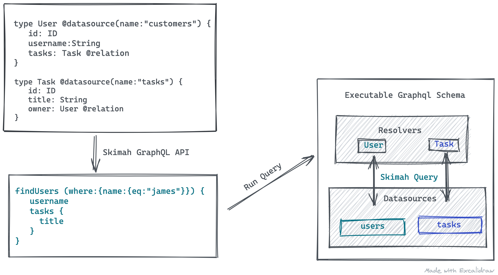
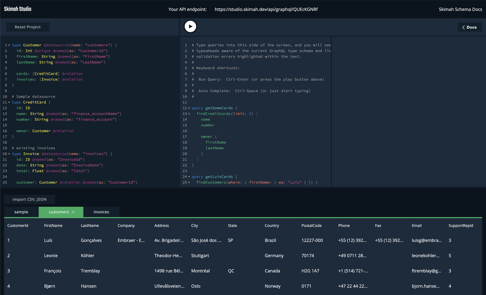

<p align="center">
</p>
<br/>
<p align="center">
<a href="#">

</a>
</p>

> A true schema-first approach to building GraphQL APIs. Map your GraphQL types directly to your datasources and query away.

<p align="center">
  <strong>
    <a href="docs/schema.md">Schema<a/>
    &nbsp;&nbsp;&bull;&nbsp;&nbsp;
    <a href="docs/datasources.md">Datasources<a/>
    &nbsp;&nbsp;&bull;&nbsp;&nbsp;
    <a href="docs/api.md">GraphQL API<a/>
    &nbsp;&nbsp;&bull;&nbsp;&nbsp;
    <a href="https://studio.skimah.dev">Skimah Studio<a/>
  </strong>
</p>

<p align="center">

</p>

## Features

- Auto-generated CRUD and Field-filtering API from the schema definition (also supports readonly types)
- Expose only the records you want to your clients via your schema definition
- Datasource agnostic using the Skimah Datasource interface. Datasources like `sql`, `csv`, `faker` e.t.c. can be easily crafted
- Schema based relationships across types from different datasources
- Legacy friendly, field and type names can be remapped from legacy datasources to GraphQL field names for a cleaner API.
- Bring your own GraphQL Server.

## Motivation

- To harness the power of graphql as an API description language
- Different APIs for different clients based on need to know basis
- Reusable resolvers/datasources by standardizing data access patterns across datasources
- Create relationships across multiple datasources transparently
- A good prototyping tool for fleshing application ideas with minimum server commitment

## Example

```javascript
import { generate } from "@skimah/api";
import csv from "@skimah/ds-csv";
import json from "@skimah/ds-json";

const users = csv({
  records: `
    id, user_name
    1,  james
    `
});

const tasks = json({
  records: [
    { id: 1, title: "compile", done: false, owner: 1 },
    { id: 2, title: "deploy", done: true, owner: 1 }
  ]
});

const sources = { users, tasks };

const typeDefs = `
    type User @datasource(name: "users") {
        id: ID
        username: String @named(as: "user_name")
        tasks: [Task] @relation
    }

    type Task @datasource(name: "tasks") {
        id: ID
        title: String
        done: Boolean
        owner: User @relation
    }
`;

// Generate an executable schema
const { schema } = generate({ typeDefs, sources });

// Use your own server here to execute queries against the schema
```

You can now run queries like the on below against the executable schema. Skimah will transparently fetch the data across the `json` and `csv` datasources

```graphql
{
  findUsers(limit: 2) {
    username
    tasks(where: { done: { eq: true } }) {
      title
    }
  }
}
```

## [Skimah Directives](docs/schema.md)

Skimah ships with a collection of directives that makes it easy to craft an API from a schema definition.

| Directive                     | Description                                                                 | Location        |
| ----------------------------- | --------------------------------------------------------------------------- | --------------- |
| [@readonly](docs/schema.md)   | Only generate read APIs for the type                                        | Object          |
| [@datasource](docs/schema.md) | Associates the type to a defined datasource. Datasources are reusable       | Object          |
| [@named](docs/schema.md)      | Rename a `type`, `field` or `relationship` from datasource to GraphQL names | Field \| Object |
| [@relation](docs/schema.md)   | Creates a relationship between types                                        | Field           |

[Skimah directives](docs/schema.md)

## [Datasources](docs/schema.md)

Datasources are the backbone of Skimah and they are quite simple to implement. They are simply a reusable CRUD interface to be implemented and are called by by the generated type resolvers for the corresponding GraphQL operations. [Datasource documentation](docs/schema.md)

A simple empty datasource implementation is as follows

```javascript
const myCustomSource = {
  select: async (selection: QueryModel) => {
    return [];
  },

  create: async (models: MutationModel[]) => {
    return { affected: [] };
  },

  update: async (criteria: Criteria, changes: MutationModel) => {
    return { affected: [] };
  },

  delete: async (criteria: Criteria, model: Model) => {
    return { affected: [] };
  }
};
```

### Packaged Datasources

| Datasource        | Description                                                            |
| ----------------- | ---------------------------------------------------------------------- |
| [@skimah/json]()  | json datasource can read records from json array records or file       |
| [@skimah/csv]()   | csv datasource can read records from a csv text or file                |
| [@skimah/faker]() | faker datasource uses fakerjs to generate records from type definition |

Other datasources like Postgres, Mysql, SQLite, Dynamodb e.t.c are coming soon.

## [GraphQL API](docs/api.md)

Skimah's GraphQL API is heavily influenced by [Hasura's](https://hasura.io) and [MongoDB API](https://docs.mongodb.com/manual/tutorial/query-documents/)

| Datasource                   | Description                                                                          |
| ---------------------------- | ------------------------------------------------------------------------------------ |
| [find](docs/api.md#find)     | A find query is generated for each type. e.g `findUser` for type called `User`       |
| [create](docs/api.md#create) | Create operation is generated for each type e.g `createUsers` for type called `User` |
| [update](docs/api.md#update) | Update operation is generated for each type e.g `updateUsers` for type called `User` |
| [delete](docs/api.md#delete) | Delete operation is generated for each type e.g `deleteUsers` for type called `User` |

## [Skimah Studio](https://studio.skimah.dev)

Experience the power of a schema-first approach to GraphQL API development with an online IDE for quickly generating GraphQL APIs and endpoints. [Give it a try](https://studio.skimah.dev)



## Coming Soon

- Support for Dataloader-ish caching
- Support for Graphql interfaces
- Support for Graphql query field alias
- Support for Graphql Unions
- Nested mutation across datasources

## Bug tracker

If you have any suggestions, bug reports, or annoyances please report them to our issue tracker at https://github.com/skimah/skimah/issues

## Links

- 🐦 Twitter: [@sayjava](https://twitter.com/sayjava)
- 👉 [Play with Skimah online](https://studio.skimah.dev)

> ⚠️ Skimah is not production ready yet but it is fabulous for quickly prototyping APIs for projects.

## License

Released under [MIT License](https://opensource.org/licenses/mit-license.php).

**Skimah** is authored and maintained by [@sayjava](http://github.com/sayjava).
