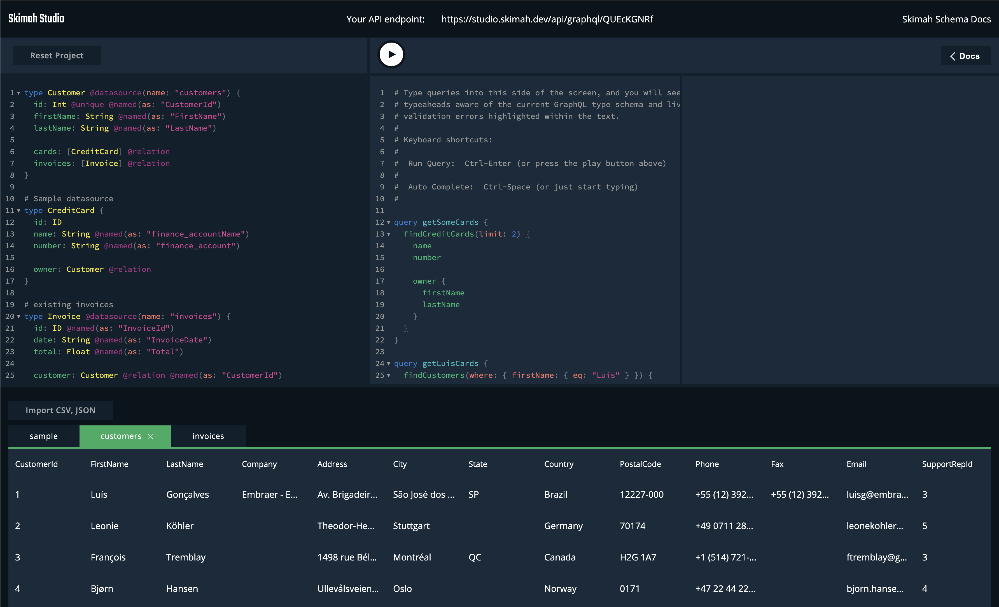

# Quick Start

```javascript
import { generate } from "@skimah/api";
import csv from "@skimah/ds-csv";
import json from "@skimah/ds-json";

const users = csv({
  records: `
    id, user_name
    1,  james
    `
});

const tasks = json({
  records: [
    { id: 1, title: "compile", done: false, owner: 1 },
    { id: 2, title: "deploy", done: true, owner: 1 }
  ]
});

const sources = { users, tasks };

const typeDefs = `
    type User @datasource(name: "users") {
        id: ID
        username: String @named(as: "user_name")
        tasks: [Task] @relation
    }

    type Task @datasource(name: "tasks") {
        id: ID
        title: String
        done: Boolean
        owner: User @relation
    }
`;

// Generate an executable schema
const { schema } = generate({ typeDefs, sources });

// Use your own server here to execute queries against the schema
```

You can now run queries like the on below against the executable schema. Skimah will transparently fetch the data across the `json` and `csv` datasources

```graphql
{
  findUsers(limit: 2) {
    username
    tasks(where: { done: { eq: true } }) {
      title
    }
  }
}
```

## [Skimah Studio](https://studio.skimah.dev)

Experience the power of a schema-first approach to GraphQL API development with an online IDE for quickly generating GraphQL APIs and endpoints. 



- Generate Skimah API on the fly
- Use your own datasources to try out your API
- Get a unique API endpoint to use in your application

[Give it a try](https://studio.skimah.dev)
