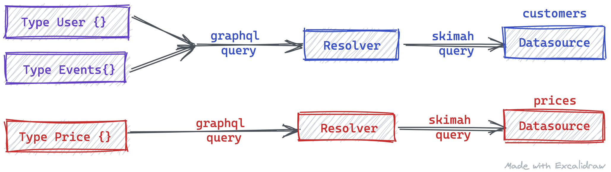

# Skimah Datasources

Under the hood Skimah generates CRUD resolvers for each defined type in a schema definition. Each resolver maps directly to a GraphQL operation which then maps those GraphQL operation and their arguments to inputs to the datasource.

## Datasource Interface

A Datasource is an object that implements the basic CRUD operations defined in the Datasource interface as described below. See the [API Documentation](/docs/api) for the CRUD operations.

```javascript
interface Datasource {
  /**
   * Called during the initialization process after the schema has been generated
   * but before queries are processed.
   *
   */
  initialize?: (models: Model[]) => Promise<any>;

  /**
   *
   * Creates a collection of records in the underlying datasource when the mutation operation is
   * invoked by the graphql operation
   *
   * @param models The models to be created in the underlying datasource
   * @return The mutation response
   */
  create: (models: MutationModel[]) => Promise<MutationResponse<any>>;

  /**
   *
   * Selects a collection of records from the datasource using the selection fields
   * from the graphql query and the criteria by which to apply to the selection operation
   *
   * @param selection The model that contains all the information needed to select
   * records from the underlying the datasource
   *
   * @returns An array of records from the underlying datasource mapped correctly using the
   * projected attributes in the query model
   */
  select: (selection: QueryModel) => Promise<Array<any>>;

  /**
   * Updates underlying datasource records with the changes from a graphql mutation operation
   *
   * @param criteria The criteria by which the changes should be applied
   * @param changes A mutation model with values to be applied
   */
  update: (
    criteria: Criteria,
    changes: MutationModel
  ) => Promise<MutationResponse<any>>;

  /**
   * Deletes underlying datasource records
   *
   * @remarks
   * Delete is a special case, in that before the delete operation is executed, the resolver
   * will do a select using the same criteria before requesting the delete execution if records
   * are requested and only if records are requested.
   *
   * @param criteria The criteria by which to delete models from the underlying datasource.
   * @param model The model representing record definition in the underlying datasource.
   */
  delete: (criteria: Criteria, model: Model) => Promise<MutationResponse<any>>;
}
```

Direct siblings that share the same datasource will have their queries batched to the same datasource. e.g Take a schema like

```graphql
type User @datasource(name: "customers") {
  id: ID
  events: [Event] @relation
}

type Event @datasource(name: "customers") {
  id: ID
  price: Price @relation
  organizer: User @relation
}

type Price @datasource(name: "prices") {
  id: ID
  amount: Number

  events: [Event] @relation
}
```

and run a query like

```graphql
{
  findUsers {
    id
    events {
      id

      price {
        amount
      }
    }
  }
}
```

In the query above, Skimah will batch the query request for `Users` and `Events` to the same datasource underneath



> ⚠️ Skimah does not at the moment support nested mutation.

## Implementations

Below is a simple implementation of a Datasource. This is good enough to implement an empty Datasource

```javascript
const myCustomSource = {
  select: async (selection: QueryModel) => {
    return [];
  },

  create: async (models: MutationModel[]) => {
    return { affected: [] };
  },

  update: async (criteria: Criteria, changes: MutationModel) => {
    return { affected: [] };
  },

  delete: async (criteria: Criteria, model: Model) => {
    return { affected: [] };
  }
};
```

## Implemented Datasources

There are some implemented datasources in the Skimah's repo that can be used to get started. There is also a `noopSource` in the `@skimah/api` library if needed

### CSV

This datasource can manipulate records stored in a CSV. e.g if there is a csv record stored in a file with records like

| id  | name  | title   |
| --- | ----- | ------- |
| 1   | james | manager |
| 2   | bond  | agent   |

with a type definition like

```graphql
type User {
  id: ID
  name: String
  title: String
}
```

then a csv datasource can be used as

```javascript
import { generate } from "@skimah/api";
import CSVSource from "@skimah/ds-csv";

const csv = new CSVSource({ filepath: "path/to/file.csv" });

const config = { default: csv, typeDefs };
const { schema } = await generate(config);
```

or as inline records

```javascript
const { datasource } = new CSVSource({
  records: `
    id, name, title
    1,  james, manager
    2,  bond,  agent
  `
});
```

### JSON

This datasource is very similar to the CSV datasource with the difference that its data comes from a JSON file or an array of json objects

```javascript
import { generate } from "@skimah/api";
import JSONSource from "@skimah/ds-json";

const jsonSource = new JSONSource({ filepath: "path/to/file.json" });
```

or for inline records

```javascript
const jsonSource = new JSONSource({ records: [{}, {}, {}] });
```

### Faker

This datasource is good for quickly prototyping an API without the massive initial commitment to implementing a full blown datasource. It uses the amazing [fakerjs](https://github.com/marak/Faker.js/) library for generating its records.

The datasource uses the `@named` directive for generating the field sample data. The format of the directive is `@named(as: fakerNamespace_function` e.g `@named(as: "name_firstName")`

see the [fakerjs documentation](https://rawgit.com/Marak/faker.js/master/examples/browser/index.html) to see the available namespaces and functions available.

```graphql
type User {
  id: ID # this will be auto generated for auto increment
  name: String @named(as: "name_firstName")

  phoneNumber: String @named(as: "phone_phoneNumber")

  # it is still possible to use field name mapping alongside fakerjs namespaces
  title: String @named(as: "userTitle_name_jobTitle")
}
```

```javascript
import { generate } from "@skimah/api";
import FakerSource from "@skimah/ds-faker";

const sampleSource = new FakerSource({
  max: 10 // the number of records to generate
});
```

### SQL

Coming soon

### Dynamodb

Coming soon

### Google Spreadsheet
